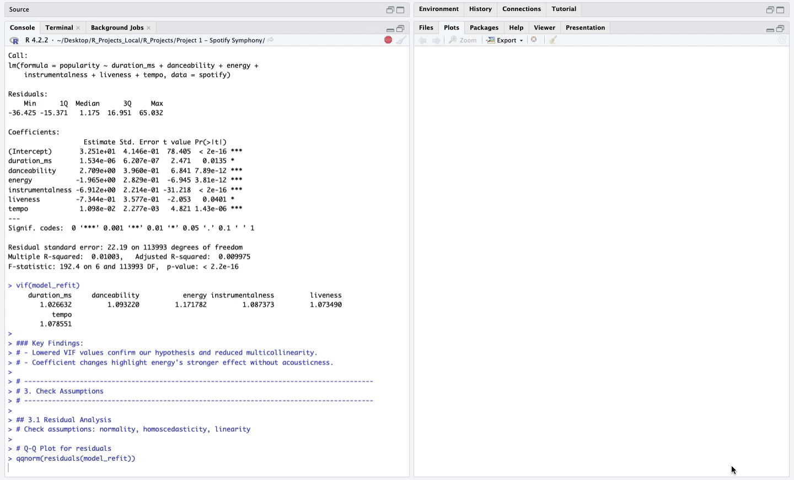

# [🎵 Spotify Symphony: A Linear Regression of Spotify Data 🎵](./Spotify%20Symphony.R)



## 🚀 **Foreword**  
This section explores the dataset through **linear regression models**, **statistical insights**, and **assumption testing**, uncovering the mathematical backbone of song Popularity. By coding the line of best fit, we are able to make future predictions and derive key insights about the data. 🎼🧪  

---

## 🎯 **Objectives**  
1. 🕵️‍♂️ Understand the significant factors influencing **song popularity**.  
3. ✅ Ensure **model assumptions** (normality, homoscedasticity, linearity) are met.
3. 🔄 Refine the model for better accuracy.   

---

## 🛠 **Skills and Tools**  
- **Programming Language:** R  
- **Libraries:** `ggplot2`, `lm`, `car`, etc.  
- **Skills Demonstrated:** Data wrangling, linear regression analysis, model diagnostics, residual analysis.

---

## 📊 Data Overview  

The `spotify_data.csv` includes information about Spotify songs. Below are the covariates analyzed:  

- **Dependent variable:** Popularity 
- **Independent variables:** Duration_ms, Danceability, Energy, Acousticness, Instrumentalness, Liveness, Tempo

---

## 🔧 **Methodology** (Parts 1-6)

### **1. 📂 Data Preparation**  
- **Imported** the dataset and previewed its structure to make sure everything loaded properly.

### **2. 🛠 Model Development**  
- Built an **initial linear regression model** to explore relationships between predictors and song popularity.
- Checked VIF values to ensure multicollineariy wasn't skewing the results.

### **3. 🔍 Assumption Checks**  
- Evaluated **model assumptions**:    
  1. **Normality** using Q-Q plots and histograms.  
  2. **Homoscedasticity** via residual vs. fitted plots.  
  3. **Linearity** through scatter plots.

Example of code used for plot analysis:
```R
# Q-Q plot for residuals to check normality
qqnorm(residuals(model_refit))
qqline(residuals(model_refit), col = "red")

# Histogram of residuals
hist(residuals(model_refit), col = "green", main = "Histogram of Residuals", xlab = "Residuals")

# Residuals vs Fitted plot to check homoscedasticity and linearity
plot(fitted(model_refit), rstudent(model_refit), 
     main = "Residuals vs Fitted Values", xlab = "Fitted Values", ylab = "Residuals")
abline(h = 0, col = "red")
```

### **4. ✂️ Model Refinement**  
- Enhanced the model through filtering problematic values by:  
  - **Excluding zero-popularity songs** which were violating assumptions.  
  - **Removing weak predictors** to improve model stability.

### **5. 🕵️‍♂️ Outliers and Influence Analysis**  
- Analyzed high-leverage and influential points using:  
  - **Hat values** for leverage.  
  - **Cook’s distance** for influence.

Example of code used for this analysis:
```R
# Calculate leverage points using hat values
hat_values <- hatvalues(model_reduced)
high_leverage <- mean(hat_values > (2 * length(coef(model_reduced)) / nrow(spotify_filtered)))
cat("High-leverage observations:", high_leverage * 100, "%\n")
```

### **6. ✅ Overall Results**  
- Summarized key findings:  
  1. **Danceability** had a positive relationship on song popularity.   
  2. **Energy, acousticness**, and **instrumentalness** negatively affected popularity.  
  3. Approximately **7%** of the data had high leverage.    
  4. No single observation was disproportionately affecting the model's coefficients.   
  5. Most variability of the data remains **unexplained**.  

---

### 🎓 **Conclusion**  

It turns out, **danceability** stole the show as the key driver of song Popularity, while **energy, acousticness, and instrumentalness** tended to bring the vibe down. Despite refining the model, tackling multicollinearity, addressing assumption violations, and examining outlier effects, the model explained only 0.5% of variability. Progress may be incremental, but it’s still progress. Overall, this was a successful deep dive into the math behind the music! 🎶📈  

---

### 📂 Access the R-File  

Click [here](./Spotify%20Symphony.R) to explore the **Spotify Symphony** code in more detail.  
Click [here](../) to return to the table of contents.

---

Sincerely,  
Julian
