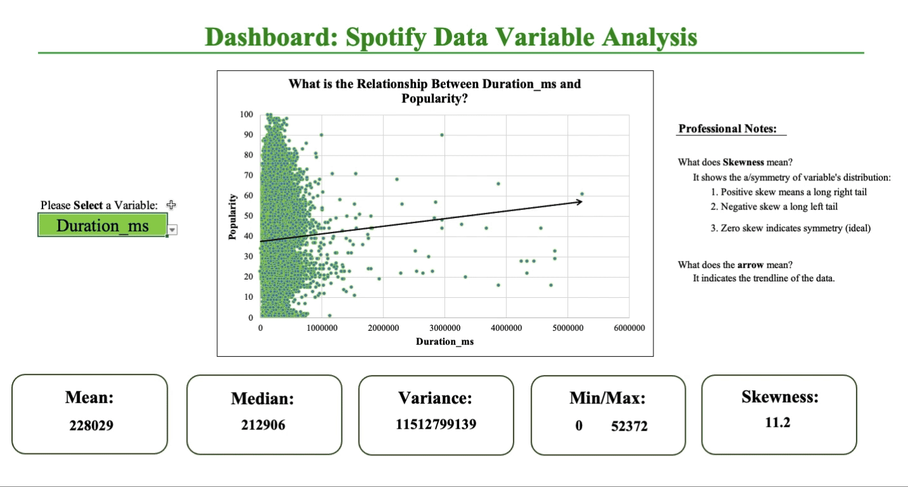

# 🎧 **Spotify Symphony: Dashboard Analysis of Song Attributes** 🎧

## 🚀 Foreword  

In this section, by leveraging the power of an interactive **Excel Dashboard**, I **dazzle** with visually compelling insights into key covariates like **Danceability**, **Energy**, and **Tempo**. Watch the story unfold through **interactive visualizations**, **pivot tables**, and more! 🎶📊

---

## 📌 Questions to Analyze  

1. **What is the relationship between each song attribute and Popularity?**
2. **How well does the linear model predict song Popularity?**
3. **Does higher Danceability always lead to higher Popularity?**

---

## Excel Skills Used  

- Dashboard Creation
- Pivot Tables
- Conditional Formatting
- Data Filtering  
- Data Visualization 

---

## 🎶 Analysis Highlights  

### 1️⃣ **What is the relationship between song attributes and Popularity?**  

#### 📊 Methodology  
- Built an **interactive** Excel Dashboard to uncover correlations between each song attribute and Popularity.  
- Incorporated **conditional formatting** and **dynamic slicers** for a visually engaging and intuitive analysis.  

#### 💡 Insights  
- Danceability and Energy showed a clear positive correlation with Popularity, making them key drivers of success.  
- **Duration_ms** exhibited the highest variation and data skewness, likely due to its millisecond scale, which could mask broader trends.

  

---

### 2️⃣ **How well does the linear model predict Popularity?**  

#### 📈 Methodology  
- Analyzed the output of the **linear regression model in R** to understand its predictive accuracy.  
- Derived and showcased the formula used to estimate Popularity based on song attributes.  

#### 💡 Insights  
- The model explained approximately **4% of the variance in Popularity**, revealing an machine learning model may be more effective.  
- **Prediction Formula**:  
   - **Popularity** = 44.93 - 0.0000045 (Duration_ms) + 2.79 (Danceability) - 4.12 (Energy) - 11.15 (Instrumentalness) - 5.48 (Liveness) - 0.0082 (Tempo).

  

---

### 3️⃣ **Does higher Danceability always lead to higher Popularity?**  

#### 🔍 Methodology  
- Leveraged **Pivot Tables** to analyze how different ranges of Danceability correspond to Popularity.  
- Connected the pivot table to a **dynamic chart** to identify key trends and exceptions visually.  

#### 💡 Insights  
- Tracks with Danceability scores between 0.6 and 0.8 had the highest median Popularity, making this the sweet spot for hits.  
- Songs with either **extremely low** or **very high Danceability** tended to have lower Popularity, indicating that balance is key.  

---

## 🎓 Conclusion  

The **Spotify Symphony** project taught me how powerful **Excel dashboards** can be for uncovering key relationships between variables. By leveraging **Pivot Tables**, **Conditional Formatting**, and **dynamic visualizations**, I gained a deeper understanding of what drives Spotify song success. This hands-on experience showed me the potential for using data analysis and statistics to create more accurate prediction models and provide actionable insights for producers and artists.

---

### 📂 Access the Project  

Click [here](Spotify_Symphony.xlsx) to explore the **Excel Dashboard** in more detail.  
Click [here](../) to return to the table of contents.

---

Kind Regards,  
**Julian Griffin**
