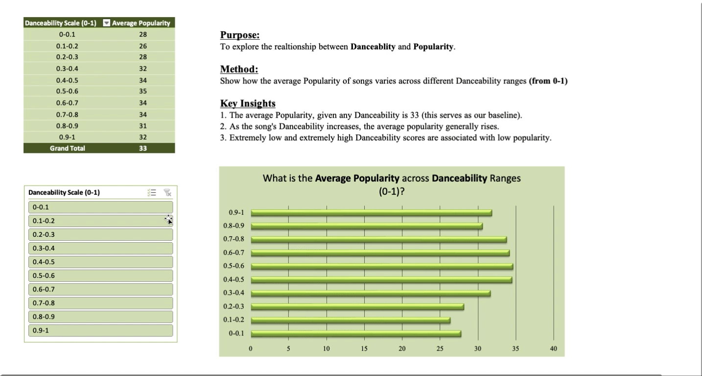

# 🎶 **Chapter 3: Results & Findings** 🎶

## 👋 **Welcome**  
*Welcome to Chapter 3!* This is the "Results & Findings" section of the project!

## 📄 **Foundation**

**Title**: Spotify Symphony: Unlocking the Secrets of the Spotify Song Algorithm   
**By**: Julian Griffin  
**Date**: January 2025  
**Data Set Provided By**: Kelly Ramsay

*This report explores the relationship between song attributes and their popularity on Spotify, using both statistical analysis and interactive dashboards to uncover insights on what drives track success.*

---

## 📖 **1. Foreword**

In this project, we set out to uncover what makes a song popular on Spotify. By analyzing key song attributes such as **Danceability**, **Energy**, and **Tempo**, I built a linear regression model in **R** along with an interactive dashboard in **Excel**. This report aims to bring everything together and provide actionable insights for producers and artists.

---

## 🌏 **2. Methodology**

1️⃣ **Chapter 1**, the goal was to statistically model and interpret the key factors influencing song popularity. 
- I employed **R** to apply linear regression and further refine the linear model.
- I addressed issues like multicollinearity, assumption violations, and outliers.

2️⃣ **Chapter 2**, the goal was to visually present trends and patterns in an accessible and user-friendly format.
- I created an interactive **Excel Dashboard** that allowed users to intuitively and seamlessly access the data.
- Used features like slicers, conditional formatting, and pivot tables. 

Both served as compliments to reveal the algorithm's secrets.

---

## 💣 **3. Key Findings**

1. **Danceability** had the strongest positive correlation with Popularity.
2. The **linear regression model** explained only 0.5% of the variability in Popularity, highlighting the complexity of predicting song success.
3. **Pivot tables** in Excel revealed that Danceability scores between 0.6 and 0.8 had the highest median popularity.

---

## 🎤 **4. Insights for Artists & Producers**

**Danceability** emerged as a key factor influencing song popularity, indicating that songs with higher danceability tend to be more successful. While **Energy** and **Tempo** also played a role in popularity, their influence was less pronounced compared to danceability.   

**My Advice for Artists**: Producers should first focus on crafting songs that resonate with specific listener moods or genres. Once that foundation is set, the next priority should be to enhance the danceability of the track, as this factor has a strong correlation with popularity. While other song attributes do show some relationship with popularity, the impact isn't substantial enough to warrant a major shift in musical direction. So, honing in on danceability could be the key to increasing a song's success.

---

## ⛵**5. Improvements**

While the linear regression model did not explain a large percentage of the variability in popularity, it still provided valuable insights.

🚀 Future improvements could involve:

  1. 🤖 **Try Advanced Models** - Experiment with **machine learning** models to improve accuracy.
  2. 📂 **Collect More Data** - Gather additional data, such as social media mentions, to improve the model’s accuracy.
  3. 💡 **Refine Feature Selection** - Explore more song attributes to see if they improve the model's predictive power.
  
---

## 🏁 **6. What I Learned**

Through this project, I gained valuable insights. Here are the three key takeaways:

1. **Application** - While basic models can offer initial insights, more sophisticated models are essential for real-world data.
2. **Visualization** - The use of visual tools like dashboards are essential to make complex data more understandable.
3. **Communication** - No matter how insightful your analysis is, being able to clearly communicate your findings to others is crucial.

---

### 📂 Access the Project  
 
Click [here](../) to return to the table of contents.

---

- Check out some of my other work:
  - [📘 Excel Projects](https://github.com/JulianGriffin11/Excel_Projects)
  - [🌺 SQL Projects](https://github.com/JulianGriffin11/SQL_Projects)  
  - [👑 R Projects](https://github.com/JulianGriffin11/R_Projects) 

Kind Regards,  
**Julian Griffin**

