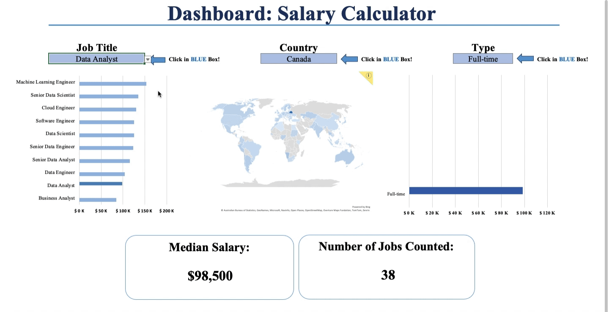

# 💸 **Payday Perspectives: Exploring Salary Trends in Data Jobs** 💸  

  

---  

## 🎬 **Background**  
Welcome to *Payday Perspectives*! In this project, I explore salary trends across various data roles, uncovering patterns by **location**, **skills**, and **experience levels**. Using **SQL** and **Excel**, I analyze a rich dataset to identify key insights and provide actionable recommendations for job seekers and employers.  

This project integrates data querying, visualization, and analysis to shed light on the factors influencing salary distributions in the ever-evolving world of data careers.  

---  

## 📚 **Table of Contents**  
1. [**Chapter 1: SQL Analysis**](./Chapter%201%20-%20SQL%20Analysis)  
   - **Querying the Dataset**: Extracting insights about salary distributions by role and location.  
   - **Skills Breakdown**: Identifying the impact of skills like Python, SQL, and R on salaries.  
   - **Data Set**: `salary_data.sql`  

2. [**Chapter 2: Excel Dashboard**](./Chapter%202%20-%20Excel%20Dashboard)  
   - **Dynamic Visualizations**: Interactive charts showcasing salary patterns by region and job type.  
   - **Pivot Table Exploration**: Analyzing specific skill combinations and their salary impact.  
   - **Actionable Insights**: Recommendations for job seekers to maximize earning potential.  

---  

### 🔍 **Questions to Analyze**  
- How do skills and experience levels affect salaries across different regions?  
- What job roles and locations offer the highest earning potential in the data field?  
- Which combinations of skills provide the greatest salary advantages?  

---  

### ⚙️ **Tools and Techniques**  
- **SQL**: Leveraged for querying, filtering, and aggregating the data to uncover meaningful trends.  
- **Excel**: Used for creating dynamic dashboards, generating pivot tables, and visualizing salary trends.  

---  

### 🚀 **Access the Project**  
- [SQL Analysis](./Chapter%201%20-%20SQL%20Analysis)  
- [Excel Dashboard](./Chapter%202%20-%20Excel%20Dashboard)  
- [Return to Portfolio](../)  

---  

I hope you find *Payday Perspectives* insightful and engaging!  

- Explore more projects:  
  - [🎧 Spotify Symphony](../Project%201%20-%20Spotify%20Symphony/README.md)  
  - [📘 Excel Projects](https://github.com/JulianGriffin11/Excel_Projects)  
  - [🌺 SQL Projects](https://github.com/JulianGriffin11/SQL_Projects)  

Cheers,  
**Julian Griffin**  
