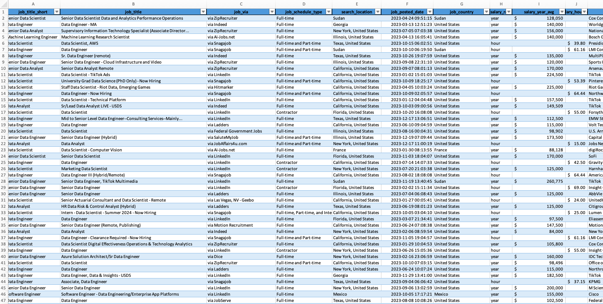
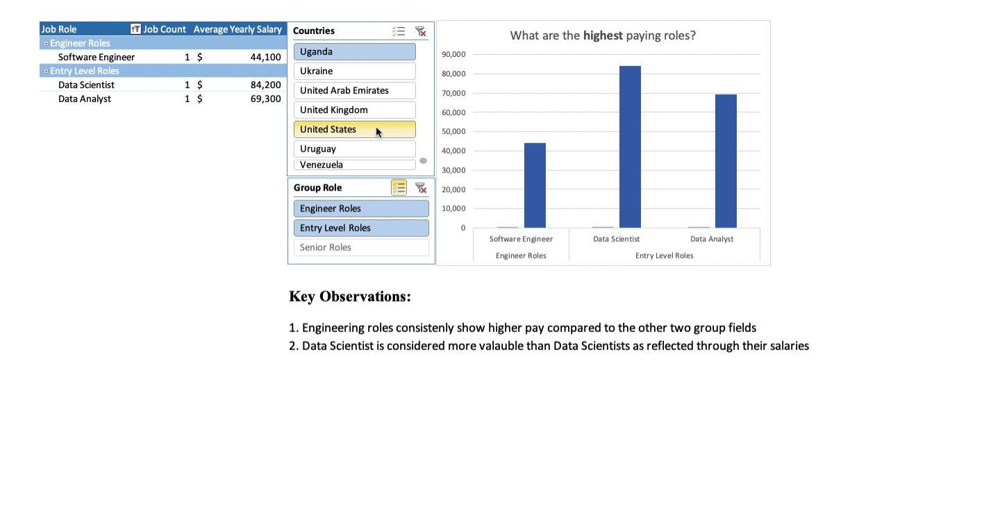
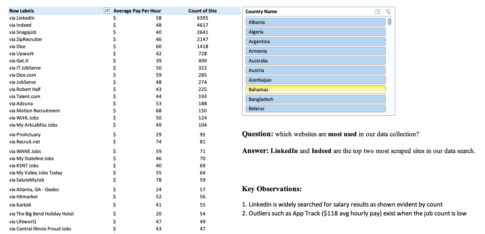

# [💰 Payday Perspectives: Salary Analytics Dashboard 💰](Payday%20Perspectives.xlsx) 

## 🛠️ Introduction  

*In this section, I present an Excel dashboard that provides a comprehensive analysis of data job market trends.* The interactive dashboard allows for the variation of 3 fields which enables a deeper understanding of the market patterns.  

By incorporating **📊 charts**, **📑 pivot tables**, and **✨ dynamic visuals**, this section makes it easy to interpret complex data and draw actionable conclusions for this amazing project.

---

## ❓ Questions to Analyze  

1. **How do salary ranges vary by location, job type, and job title?**
2. **What are the average salaries across different data job roles?**  
3. **Where are the job roles extracted from?**  

---

## 📈 Excel Skills Used  

- **🔍 Filtering and Sorting**
- **📊 Pivot Tables**  
- **📌 Conditional Formatting**  
- **🔄 Data Cleaning and Validation**  
- **🧮 Statistical Analysis**  

---

## 📋 Data Overview  

The dataset consolidates information on data job postings, including:

- **📋 Job Titles**: Roles like Data Scientist, **Machine Learning Engineer**, etc.
- **📆 Job Schedules**: Full-time, part-time, or flexible positions.
- **💼 Job Platforms**: Sources like **Indeed**, ZipRecruiter, etc. 
- **🌍 Location**: Specific countries where jobs are posted.  
- **💰 Salary Details**: Yearly and hourly **rates** for posted roles.  

 

---

## 📊 Analysis Highlights  

### 1️⃣ **How do salary ranges vary by location, job type, and job title?**  

#### 📈 Methodology  
- Utilized the **dashboard** for visualizing location and job title-based salary trends.  
- Used dynamic slicers to adjust for job type and regions.  

#### 💡 Insights  
- In Canada through the sites searched, the median salary for Data Analysts (full-time) is just under $100,000/year.  
- Machine Learning Engineer showed the highest median salary in Canada compared to the other Data roles.  

  

  

---

### 2️⃣ **What are the average salaries across different data job roles?**  

#### 🔍 Methodology  
- Analyzed the **Pivot_Roles** sheet to group job roles and calculate averages.  
- Highlighted key trends using pivot table summaries.  

#### 💡 Insights  
- Engineering roles and senior roles share about the same average yearly salary.
- **Data Analysts** roles remained popular, though with an average salary of $85,000/year.  

  

---

### 3️⃣ **Where are the job roles extracted from?**  

#### 🧮 Methodology  
- Used the **Pivot_Via** sheet to count and compare postings by region and platform.  
- Created heatmaps to visualize job posting density.  

#### 💡 Insights  
- **Indeed** and **LinkedIn** led as the top platforms for job postings in North America.  
- Internationally, postings were more distributed across many different platforms.  

---

## ✅ Conclusion  

The **Payday Perspectives** dashboard highlights the intersection of data visualization and market analysis, bringing clarity to the complexities of salary trends in the data industry. From identifying lucrative roles like Machine Learning Engineer to analyzing platforms with the most job opportunities, this project serves as a resource for informed decision-making in career planning.  

With insights into location-specific salaries, job type preferences, and average pay scales, this dashboard demonstrates how data analysis can empower individuals to navigate the job market with confidence and precision.  

---

### 📂 Access the Project  

Click [here](Payday%20Perspectives.xlsx) to explore the **Payday Perspectives** spreadsheet in more detail. (Note: the workbook is protected to maintain data integrity.)
Click [here](../) to return to the table of contents.

---

- Check out some of my other work:
  - [📘 Excel Projects](https://github.com/JulianGriffin11/Excel_Projects)
  - [🌺 SQL Projects](https://github.com/JulianGriffin11/SQL_Projects)  
  - [👑 R Projects](https://github.com/JulianGriffin11/R_Projects) 

Kind Regards,  
Julian
