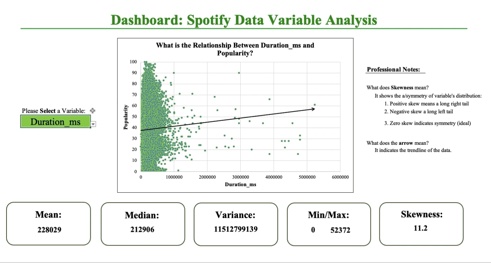
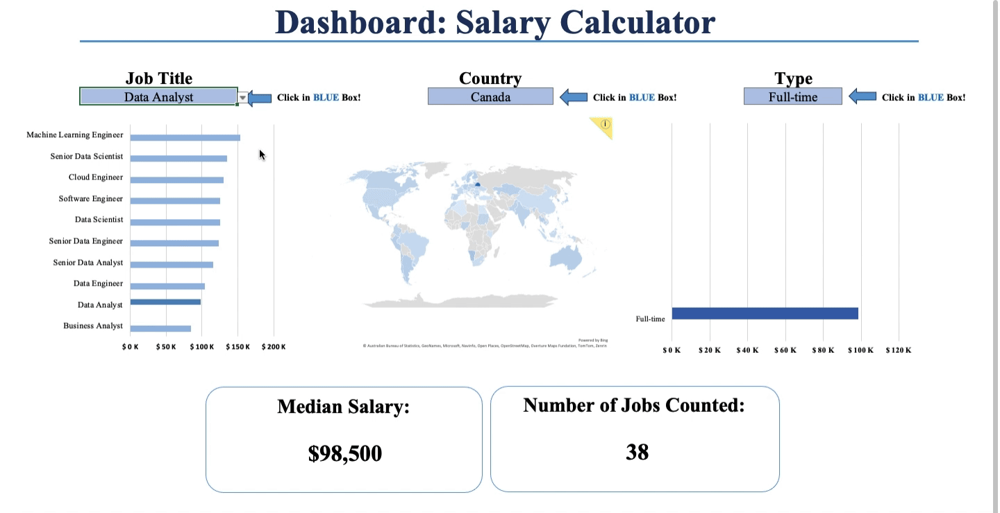

# 🧠 Portfolio Projects

Welcome to my **Portfolio Projects** repository! 🌍  

Here you will find my **Statistics, Data, and Financial Analytics** projects. Use the **heading links** to dive into each project!

---

## 🗂️ Projects

### 1. [💥 **Project 1 - Spotify Symphony** 💥](./Project%201%20-%20Spotify%20Symphony) 
- **Summary**: This project aims to uncover key insights into the Spotify song algorithm. A linear regression model is built to explore relationships between various song attributes like danceability, energy, tempo, and more to predict song Popularity. Come explore my aesthetic visualizations and indepth analysis! 
- **Applications**: R, Excel
- **Professional Skills**:  
  - Dashboard Construction
  - Pivot Table Analysis
  - Linear Regression Analysis
  - Data Wrangling using libraries like `ggplot2`, `lm`, `car`, etc.
- **Important Note**: Please ensure your working directory is set when acessing the R files!

 

---

### 2. [**💎 Project 2 - Payday Perspectives 💎**](./Project%202%20-%20Payday%20Perspectives)
 
- **Summary**: This project uncovers the hidden treasures of the data job market, revealing the highest-paying positions and the skills that unlock them. Through a powerful dashboard and in-depth analysis, it paints a clear picture of technical skills, requirements, and oppurtunities to land my dream job. Will you join me in this mathematical journey?
- **Applications**: SQL, Excel
- **Techniques Mastered**: 
  - Advanced Excel functions (e.g., **VLOOKUP**, **INDEX-MATCH**)
  - Conditional formatting
  - Complex SQL queries with JOINs and subqueries
  - Data aggregation using GROUP BY

 

### Notes: 
- For each project, you may need to download the necessary data files (like `spotify_data.csv`) and run them on your local system.
- When acessing any code, please ensure that your **working directory** is set correctly to avoid pathing issues.
  
---

🚀 Click the heading links to dive deeper into each project! 🚀

- Check out some of my other work:
  - [📘 Excel Projects](https://github.com/JulianGriffin11/Excel_Projects)
  - [🌺 SQL Projects](https://github.com/JulianGriffin11/SQL_Projects)  
  - [👑 R Projects](https://github.com/JulianGriffin11/R_Projects) 

Yours in solutions,   
**Julian Griffin**
