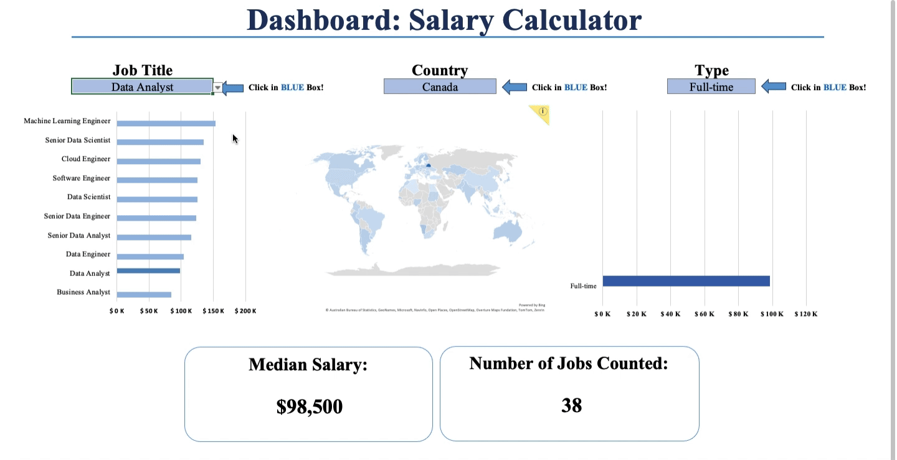

# 💻 Portfolio Projects

Welcome to my **Portfolio Projects** repository! 🎯  

Here you will find my **Statistics, Data, and Financial Analytics** projects. Use the **heading links** to dive into each project!

---

## 🗂️ Projects

### 1. [🎵 **Project 1 - Spotify Symphony** 🎵](./Project%201%20-%20Spotify%20Symphony) 
- **Summary**: This project dives into the world of Spotify data to uncover what drives song popularity. A linear regression model is built to explore relationships between various song attributes like danceability, energy, tempo, etc. 
- **Skills Learned**:  
  - Linear Regression Analysis  
  - Model Diagnostics and Assumption checks  
  - Data Wrangling using libraries like `ggplot2`, `lm`, `car`, etc.
- **Important Note**: Please make sure your working directory is set when running the file!
  

 

---

### 2. [**📊 Project 2 - Payday Perspectives 📊**](./Project%202%20-%20Payday%20Perspectives)
 
- **Summary**: Job market analysis dashboard that simplifies salary tracking within the data field. Includes dynamic visuals and fields for better interpretation.  
- **Skills Learned**: 
  - Advanced Excel functions (e.g., **VLOOKUP**, **INDEX-MATCH**)
  - Conditional formatting to indicate outliers
  - Detailed Pivot tables, and more!
    
 

### Notes: 
- For each project, feel free to download the necessary data files (like `spotify_data.csv`) and run them on your local system.
- Ensure your **working directory** is set correctly to avoid path issues.
  
---

🚀 Click the heading links to dive deeper into each project! 🚀

- Check out some of my other work:  
  - [📊 SQL Projects](https://github.com/JulianGriffin11/SQL_Projects)  
  - [📘 Excel Projects](https://github.com/JulianGriffin11/Excel_Projects)  

Yours in solutions,   
**Julian Griffin :)**
