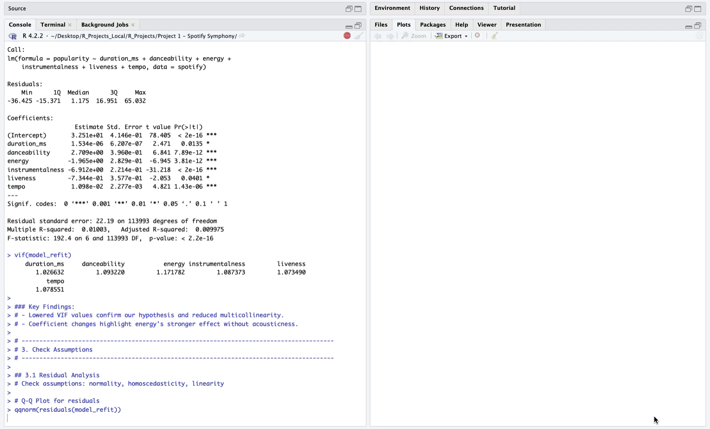

# 💻 Portfolio Projects

Welcome to my **Portfolio Projects** repository! 🎯  

Explore data-driven stories and models through real-world case studies in **Excel**, **SQL**, and **R**. Use the project links below to discover detailed analysis, dynamic visualizations, and insights.

---

## 🗂️ Projects

### 1. [🎵 **Spotify Symphony** 🎵](./Project%201%20-%20Spotify%20Symphony/README.md)  
- **Summary**: A deep dive into Spotify data, exploring what makes a song popular.  
- **Tools**: R, Excel  
- **Skills**: Linear Regression, Model Diagnostics, Data Visualization  

### 2. [🏡 **Payday Perspectives** 🏡](./Project%202%20-%20Payday%20Perspectives/README.md)  
- **Summary**: An analysis of payroll trends using SQL and Excel.  
- **Tools**: SQL, Excel  
- **Skills**: Query Optimization, Financial Analysis, Visualization  

---

### 🔗 Check out individual toolsets
- [📊 SQL Projects](https

